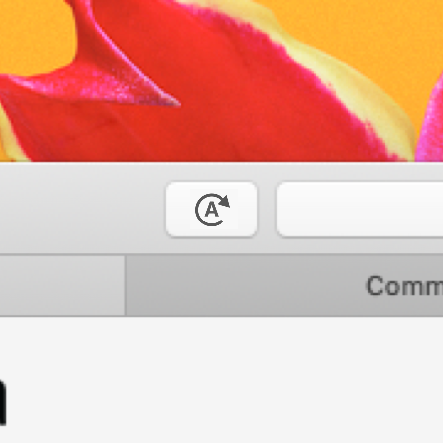

<h1>

Reload All
</h1>

Refresh all Safari browser tabs at once.

While access to website info is necessary for function, no data is collected. A small script is added to pages to initialize global reload and the rest is handled by the extension.

After installing from the App Store, open Reload All to add the extension to Safari. Enable or disable the toolbar button in Safari preferences. Drag the application to Trash to completely uninstall the extension.

-------------------------------------
Copyright &copy; 2022 Garrett Johnson
